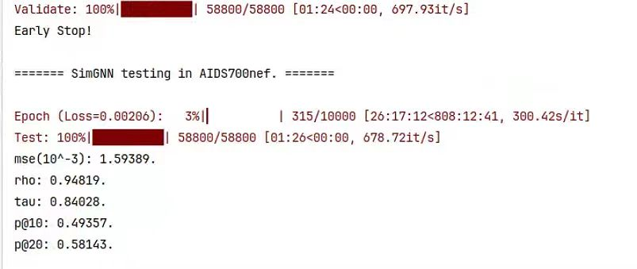

# [SimGNN](https://arxiv.org/abs/1808.05689):
`[WSDM 2019] SimGNN: A Neural Network Approach to Fast Graph Similarity Computation`

**本实现完全按照[SimGNN论文](https://arxiv.org/abs/1808.05689)中的代码设置实现**


中文版 | [English](./README_en.md)

## 目录结构:
```
SimGNN/
├── datasets/           # 存放数据集文件
│   ├── AIDS700nef/
│   ├── ALKANE/
│   ├── IMDBMulti/
│   ├── ...(may be other datasets)
|   └── LINUX/
├── imgs/               # 存放readme中的图片等资源
├── Logs/               # 存放日志文件
├── model/              # 模型代码
│   ├── layers.py       # 包含Att模块，NTN模块
│   ├── SimGNN.py       # SimGNN模型部分
|   └── Trainer.py      # 训练、验证和测试模块
├── utils/
│   ├── config.py       # 系统级参数，例如数据集名称等
│   ├── config.yml      # 模型级、数据集级参数，例如训练epochs，patience，num_features等
|   └── utils.py        # 工具，包含加载数据集，加载配置等
└── main.py             
```
> 需要[下载datasets](https://drive.google.com/drive/folders/1MOOUxxC_76Jseuc-JWaJ6B6LfU6-wNfR?usp=drive_link)，包含`AIDS700nef`，`LINUX`，`IMDBMulti`，`ALKANE`数据集
> 
> 1. 将下载的`datasets.tar.gz`压缩文件移动到`SimGNN`目录下
>
> 2. 解压缩: `tar -xvzf datasets.tar.gz`
> 
> 3. 解压缩完成后进入`datasets/`目录，使用相同的命令再次解压缩四个数据集即可
>
> P.s: 实际上，如果你不下载我提供的数据集，也可以直接在`SimGNN/`项目根目录下创建`datasets/`目录，此时`GEDDataset`函数会自动下载数据集。

## 环境依赖:
```
pyyaml == 6.0.1
wandb == 0.16.2
python == 3.9
numpy == 1.26
scipy == 1.11
tqdm == 4.66.1
texttable == 1.7
torch == 2.1.0
torch-geometric == 2.4.0
```

## run:
```
# AIDS700nef
python main.py
# LINUX
python main.py --dataset LINUX
# IMDBMulti
python main.py --dataset IMDBMulti
# ALKANE
python main.py --dataset ALKANE
```

## 原文结果：
| datasets | MSE($10^{-3}$) | $\rho$ | $\tau$ | $p@10$ | $p@20$ |
|:----:|:----:|:----:|:----:|:----:|:----:|
| AIDS700nef | 1.189 | 0.843 | 0.690 | 0.421 | 0.514 |
| LINUX | 1.509 | 0.939 | 0.830 | 0.942 | 0.933 |
| IMDBMulti | 1.264 | 0.878 | 0.770 | 0.759 | 0.777 |

## 运行结果:
### AIDS700nef:
1. 


2. 


### LINUX
施工中，等待更新。

### IMDBMulti
施工中，等待更新。

### ALKANE
- 可惜的是，这个数据集结果不太正常。
- 不过[SimGNN原文](https://arxiv.org/abs/1808.05689)中也并没有涉及到这个数据集，因此我也没有仔细研究原因。
- 有兴趣的话可以继续研究问题所在。

> 如果你喜欢这个的项目的话，请给我们Stars ~