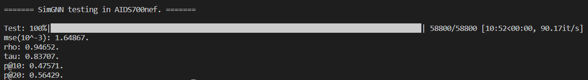
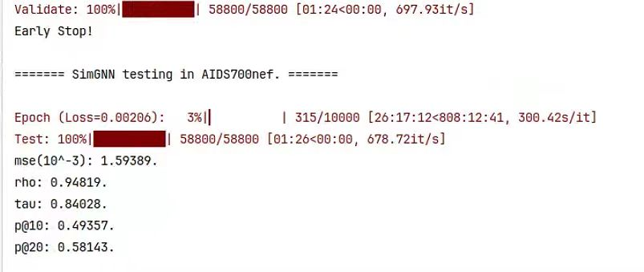

# [SimGNN](https://arxiv.org/abs/1808.05689):
`[WSDM 2019] SimGNN: A Neural Network Approach to Fast Graph Similarity Computation`

**This implementation is modeled exactly according to the code setup in the [SimGNN paper](https://arxiv.org/abs/1808.05689)**


[中文版](./README.md) | English

## directory structure:
```
SimGNN/
├── datasets/           
│   ├── AIDS700nef/
│   ├── ALKANE/
│   ├── IMDBMulti/
│   ├── ...(may be other datasets)
|   └── LINUX/
├── imgs/               # contain the imgs files in readme
├── Logs/               # store log files
├── model/              # contain the model code
│   ├── layers.py       # including 'Att' and 'NTN' modules
│   ├── SimGNN.py       # the code of SimGNN
|   └── Trainer.py      # contain train, validate, test modules
├── utils/
│   ├── config.py       # System-level parameters, such as data set names
│   ├── config.yml      # Model level, data set level parameters, such as patience, num_features 
|   └── utils.py        # Tools, including loading data sets, loading configurations
└── main.py             
```
> You need to [download datasets](https://drive.google.com/drive/folders/1MOOUxxC_76Jseuc-JWaJ6B6LfU6-wNfR?usp=drive_link), which include `AIDS700nef`, `LINUX`, `IMDBMulti`, `ALKANE` datasets
>
> 1. Move the downloaded `datasets.tar.gz` compressed file to `SimGNN/`
>
> 2. Decompress: `tar -xvzf datasets.tar.gz`
>
> 3. After the decompression is complete, `cd datasets/` and use the same command to decompress the four datasets again
>
> P.s: In fact, if you don't download the dataset which I provided, you can just execute `datasets/` in the `SimGNN/` project root directory, and the `GEDDataset` function will automatically download these dataset.

## Requirements:
```
pyyaml == 6.0.1
python == 3.9
numpy == 1.26
scipy == 1.11
tqdm == 4.66.1
texttable == 1.7
torch == 2.1.0
torch-geometric == 2.4.0
```

## run:
```
# AIDS700nef
python main.py
# LINUX
python main.py --dataset LINUX
# IMDBMulti
python main.py --dataset IMDBMulti
# ALKANE
python main.py --dataset ALKANE
```

## Official Result:
| datasets | MSE($10^{-3}$) | $\rho$ | $\tau$ | $p@10$ | $p@20$ |
|:----:|:----:|:----:|:----:|:----:|:----:|
| AIDS700nef | 1.189 | 0.843 | 0.690 | 0.421 | 0.514 |
| LINUX | 1.509 | 0.939 | 0.830 | 0.942 | 0.933 |
| IMDBMulti | 1.264 | 0.878 | 0.770 | 0.759 | 0.777 |

## Self Result:
### AIDS700nef:
1. 


2. 


### LINUX
Please wait for several days~~

### IMDBMulti
Please wait for several days~~

### ALKANE
- Unfortunately, this data set turned out to be abnormal.
- But in [SimGNN paper](https://arxiv.org/abs/1808.05689), this `ALKANE` dataset is not covered in the official datasets, so I didn't look into why.
- If you're interested, you can follow up on the problem.

> If you like this project, please send us Stars ~